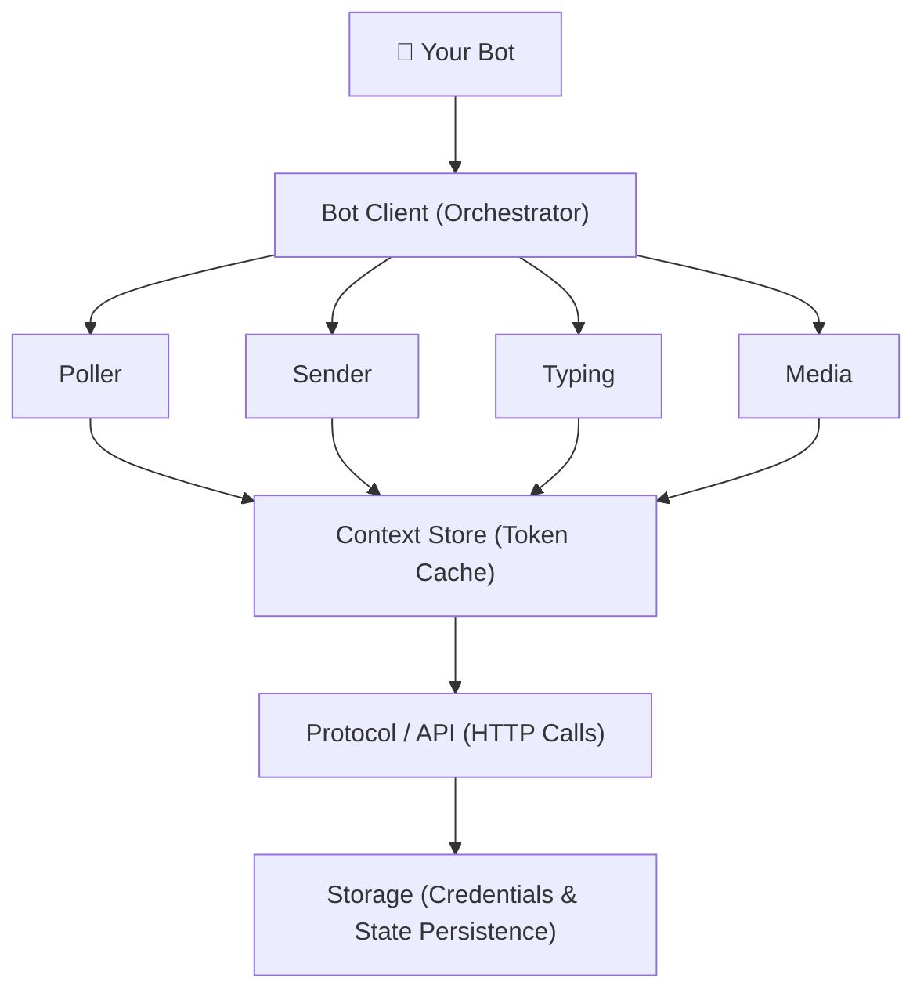

# WeChatBot

<p align="center">
  <strong>WeChat iLink Bot SDK for OpenClaw / AI Agent</strong><br/>
  <sub>Modular, production-grade, multi-language WeChat iLink Bot SDK</sub>
</p>

<p align="center">
  <a href="https://www.npmjs.com/package/@wechatbot/wechatbot"></a>
  <a href="https://github.com/corespeed-io/wechatbot/blob/main/LICENSE"></a>
  <a href="https://github.com/corespeed-io/wechatbot"></a>
</p>

---

[中文文档](README.md)

Connect any agent to WeChat in 5 minutes. Inspired by [openclaw-weixin-cli](https://www.npmjs.com/package/@tencent-weixin/openclaw-weixin).

## 📦 SDKs

| SDK | Install | Status |
|-----|---------|--------|
| [Node.js](nodejs/) | `npm install @wechatbot/wechatbot` | ✅ Production Ready |
| [Python](python/) | `pip install wechatbot-sdk` | ✅ Production Ready |
| [Go](golang/) | `go get github.com/corespeed-io/wechatbot/golang` | ✅ Production Ready |
| [Rust](rust/) | `cargo add wechatbot` | ✅ Production Ready |

## 🔧 Quick Install (Prebuilt Binaries)

No build tools needed — download and run. Supports **Windows / macOS / Linux**.

**macOS / Linux:**

```bash
curl -fsSL https://raw.githubusercontent.com/corespeed-io/wechatbot/main/install.sh | bash
```

**Windows (PowerShell):**

```powershell
irm https://raw.githubusercontent.com/corespeed-io/wechatbot/main/install.ps1 | iex
```

**Pin a version:**

```bash
# macOS / Linux
curl -fsSL https://raw.githubusercontent.com/corespeed-io/wechatbot/main/install.sh | bash -s -- --version v0.1.0

# Windows
install.ps1 -Version v0.1.0
```

Or download directly from [GitHub Releases](https://github.com/corespeed-io/wechatbot/releases).

| Platform | Go Binary | Rust Binary |
|----------|----------|------------|
| Windows x64 | ✅ `windows-amd64.exe` | ✅ `rust-windows-amd64.exe` |
| Windows ARM64 | ✅ `windows-arm64.exe` | 🔜 |
| macOS x64 | ✅ `darwin-amd64` | ✅ `rust-darwin-amd64` |
| macOS ARM64 | ✅ `darwin-arm64` | ✅ `rust-darwin-arm64` |
| Linux x64 | ✅ `linux-amd64` | ✅ `rust-linux-amd64` |
| Linux ARM64 | ✅ `linux-arm64` | ✅ `rust-linux-arm64` |

## ⚡ Quick Start

### Node.js

```typescript
import { WeChatBot } from '@wechatbot/wechatbot'

const bot = new WeChatBot()
await bot.login()                             // QR code login
bot.onMessage(async (msg) => {
  await bot.reply(msg, `Echo: ${msg.text}`)   // Auto reply
})
await bot.start()
```

### Python

```python
from wechatbot import WeChatBot

bot = WeChatBot()

@bot.on_message
async def handle(msg):
    await bot.reply(msg, f"Echo: {msg.text}")

bot.run()  # login + start in one call
```

### Go

```go
bot := wechatbot.New()
bot.Login(ctx, false)
bot.OnMessage(func(msg *wechatbot.IncomingMessage) {
    bot.Reply(ctx, msg, fmt.Sprintf("Echo: %s", msg.Text))
})
bot.Run(ctx)
```

### Rust

```rust
let bot = WeChatBot::new(BotOptions::default());
bot.login(false).await?;
bot.on_message(Box::new(|msg| {
    println!("{}: {}", msg.user_id, msg.text);
})).await;
bot.run().await?;
```

## 🤖 Pi Agent Extension

Chat with [Pi coding agent](https://github.com/badlogic/pi-mono) directly from WeChat — scan QR code to connect.

```bash
# Install the extension (recommended)
pi install npm:@wechatbot/pi-agent

# Then in Pi:
/wechat          # Show QR code → Scan with WeChat → Connected!
```

See [pi-agent/README.md](pi-agent/README.md) for details.

## ✨ Features

All SDKs share the following capabilities:

| Feature | Description |
|---------|-------------|
| 🔐 QR Code Login | Credential persistence, stored in `~/.wechatbot/` |
| 📨 Long Polling | Reliable message receiving with automatic cursor management |
| 💬 Rich Media | Images, files, voice, video (upload + download) |
| 🔗 context_token | Automatic lifecycle management, persists across restarts |
| ⌨️ Typing Status | "Typing..." indicator with ticket caching |
| 🔒 CDN Encryption | AES-128-ECB with dual-key format support |
| ♻️ Session Recovery | Auto re-login on session expiry (`-14`) |
| 📝 Smart Chunking | Split text by natural boundaries (paragraphs → lines → spaces) |

### Node.js Exclusive Features

| Feature | Description |
|---------|-------------|
| 🧩 Middleware Pipeline | Express/Koa-style composable middleware |
| 📦 Pluggable Storage | File, memory, or custom (Redis, SQLite…) |
| 🎯 Typed Events | Full IntelliSense lifecycle monitoring |
| 📝 Structured Logging | Leveled, context-aware, pluggable transports |
| 🏗️ Message Builder | `.text().image().file().build()` chaining API |

## 👥 Multi-Tenant / Multi-Account

Every bot instance is fully isolated (own HTTP client, events, message poller) with no global state and no local ports — one backend process can run many WeChat accounts side by side. The QR code is delivered via callback, so you can push it to a web frontend and let each user scan from their own page:

```typescript
// One instance per tenant, credentials isolated per tenant
const bot = new WeChatBot({
  storage: new PostgresStorage(pool, tenantId),  // or { storageDir: `/data/${tenantId}` }
})

await bot.login({
  callbacks: {
    onQrUrl: (url) => pushQrToWebUI(tenantId, url),  // render on that user's page
    onScanned: () => notify(tenantId, 'Scanned — waiting for confirmation'),
    onExpired: () => refreshQr(tenantId),
  },
})
await bot.start()
```

Three things to watch:

1. **Storage isolation** — each account needs its own `storageDir` or storage namespace; sharing one overwrites credentials.
2. **One live instance per account** — only one poller per account across your whole fleet, or message cursors overwrite each other; use an advisory lock or lease table in multi-machine deployments.
3. **Restart without rescanning** — credentials are persisted, so `login()` restores the session after a restart.

Full example (including a custom PostgreSQL storage) in the [Node.js SDK docs](https://github.com/jiweiyuan/wechatbot-landing).

## 🏗 Architecture



## 📖 Documentation

| Document | Description |
|----------|-------------|
| [docs/protocol.md](docs/protocol.md) | iLink Bot API Protocol Reference |
| [docs/architecture.md](docs/architecture.md) | Architecture Design & SDK Comparison |
| [nodejs/README.md](nodejs/README.md) | Node.js SDK Documentation |
| [python/README.md](python/README.md) | Python SDK Documentation |
| [golang/README.md](golang/README.md) | Go SDK Documentation |
| [rust/README.md](rust/README.md) | Rust SDK Documentation |
| [pi-agent/README.md](pi-agent/README.md) | Pi Extension (WeChat ↔ Pi Bridge) |

## 🌐 Website

The bilingual documentation website has been moved to a separate repository: [jiweiyuan/wechatbot-landing](https://github.com/jiweiyuan/wechatbot-landing)

## 📁 Project Structure

```
wechatbot/
├── nodejs/                # Node.js SDK (TypeScript)
│   ├── src/               #   11 modules
│   ├── tests/             #   8 test files
│   └── examples/          #   4 example bots
├── python/                # Python SDK (async/aiohttp)
│   ├── wechatbot/         #   6 modules
│   └── tests/             #   2 test files
├── golang/                # Go SDK (pure stdlib)
│   ├── bot.go             #   Bot client
│   ├── types.go           #   Type definitions
│   └── internal/          #   protocol, auth, crypto
├── rust/                  # Rust SDK
│   └── src/               #   6 modules
├── pi-agent/              # Pi Extension (WeChat ↔ Pi Bridge)
│   └── src/               #   Extension entry & WeChat client
└── docs/                  # Shared documentation
    ├── protocol.md        #   iLink API Protocol Spec
    └── architecture.md    #   Architecture & SDK Comparison
```

## ⭐ Star History

[](https://star-history.com/#corespeed-io/wechatbot&Date)

## 📄 License

[MIT](LICENSE)
