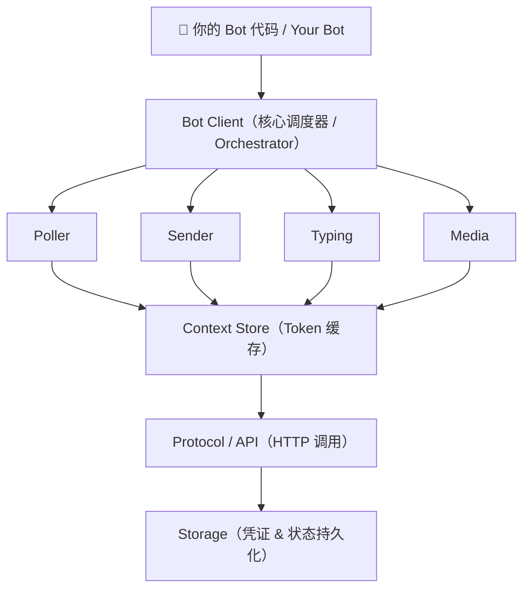

# WeChatBot

<p align="center">
  <strong>微信 iLink Bot SDK for OpenClaw / AI Agent</strong><br/>
  <sub>Modular, production-grade, multi-language WeChat iLink Bot SDK</sub>
</p>

<p align="center">
  <a href="https://www.npmjs.com/package/@wechatbot/wechatbot"></a>
  <a href="https://github.com/corespeed-io/wechatbot/blob/main/LICENSE"></a>
  <a href="https://github.com/corespeed-io/wechatbot"></a>
</p>

---

5 分钟让任何 Agent 接入微信。灵感来自 [openclaw-weixin-cli](https://github.com/nicepkg/openclaw-weixin)。

> Connect any agent to WeChat in 5 minutes. Inspired by [openclaw-weixin-cli](https://github.com/nicepkg/openclaw-weixin).

## 📦 SDK 一览 / SDKs

| SDK | 安装 / Install | 状态 / Status |
|-----|---------------|---------------|
| [Node.js](nodejs/) | `npm install @wechatbot/wechatbot` | ✅ 生产就绪 |
| [Python](python/) | `pip install wechatbot-sdk` | ✅ 生产就绪 |
| [Go](golang/) | `go get github.com/corespeed-io/wechatbot-go` | ✅ 生产就绪 |
| [Rust](rust/) | `wechatbot = "0.1"` | ✅ 生产就绪 |

## ⚡ 快速开始 / Quick Start

### Node.js

```typescript
import { WeChatBot } from '@wechatbot/wechatbot'

const bot = new WeChatBot()
await bot.login()                             // 扫码登录 / QR code login
bot.onMessage(async (msg) => {
  await bot.reply(msg, `Echo: ${msg.text}`)   // 自动回复 / Auto reply
})
await bot.start()
```

### Go

```go
bot := wechatbot.New()
bot.Login(ctx, false)
bot.OnMessage(func(msg *wechatbot.IncomingMessage) {
    bot.Reply(ctx, msg, fmt.Sprintf("Echo: %s", msg.Text))
})
bot.Run(ctx)
```

### Rust

```rust
let bot = WeChatBot::new(BotOptions::default());
bot.login(false).await?;
bot.on_message(Box::new(|msg| {
    println!("{}: {}", msg.user_id, msg.text);
})).await;
bot.run().await?;
```

## 🤖 Pi Agent 扩展 / Pi Agent Extension

在微信中直接与 [Pi 编程助手](https://github.com/badlogic/pi-mono) 对话 — 扫码即连。

> Chat with [Pi coding agent](https://github.com/badlogic/pi-mono) directly from WeChat — scan QR code to connect.

```bash
# 加载扩展 / Load the extension
pi -e /path/to/wechatbot/pi-agent/src/index.ts

# 在 Pi 中执行 / Then in Pi:
/wechat          # 显示二维码 → 微信扫码 → 连接成功！
```

详见 [pi-agent/README.md](pi-agent/README.md)。

## ✨ 核心功能 / Features

所有 SDK 共享以下能力：

| 功能 | 说明 |
|------|------|
| 🔐 扫码登录 | 凭证持久化，存储于 `~/.wechatbot/` |
| 📨 长轮询消息 | 可靠消息接收，自动游标管理 |
| 💬 富媒体支持 | 图片、文件、语音、视频（上传 + 下载） |
| 🔗 context_token | 自动生命周期管理，跨重启持久化 |
| ⌨️ 输入状态 | "对方正在输入中"，含 ticket 缓存 |
| 🔒 CDN 加密 | AES-128-ECB，支持双密钥格式 |
| ♻️ 会话恢复 | 会话过期（`-14`）自动重新登录 |
| 📝 智能分片 | 按自然边界拆分文本（段落 → 行 → 空格） |

### Node.js 独有功能

| 功能 | 说明 |
|------|------|
| 🧩 中间件管道 | Express/Koa 风格可组合中间件 |
| 📦 可插拔存储 | 文件、内存，或自定义（Redis、SQLite…） |
| 🎯 类型化事件 | 完整 IntelliSense 生命周期监控 |
| 📝 结构化日志 | 分级、上下文感知、可插拔传输 |
| 🏗️ 消息构建器 | `.text().image().file().build()` 链式 API |

## 🏗 架构 / Architecture



## 📖 文档 / Documentation

| 文档 | 说明 |
|------|------|
| [docs/protocol.md](docs/protocol.md) | iLink Bot API 协议参考 |
| [docs/architecture.md](docs/architecture.md) | 架构设计 & SDK 对比 |
| [nodejs/README.md](nodejs/README.md) | Node.js SDK 文档 |
| [python/README.md](python/README.md) | Python SDK 文档 |
| [golang/README.md](golang/README.md) | Go SDK 文档 |
| [rust/README.md](rust/README.md) | Rust SDK 文档 |
| [pi-agent/README.md](pi-agent/README.md) | Pi 扩展文档（微信 ↔ Pi 桥接） |

## 🌐 网站 / Website

项目包含双语网站（中文 + English），基于 Next.js + next-intl 构建。

```bash
cd website && npm run dev  # http://localhost:8045
```

## 📁 项目结构 / Project Structure

```
wechatbot/
├── nodejs/                # Node.js SDK（TypeScript）
│   ├── src/               #   11 个模块
│   ├── tests/             #   6 个测试文件
│   └── examples/          #   3 个示例 Bot
├── python/                # Python SDK（async/aiohttp）
│   ├── wechatbot/         #   6 个模块
│   └── tests/             #   2 个测试文件
├── golang/                # Go SDK（纯标准库）
│   ├── bot.go             #   Bot 客户端
│   ├── types.go           #   类型定义
│   └── internal/          #   protocol, auth, crypto
├── rust/                  # Rust SDK
│   └── src/               #   6 个模块
├── pi-agent/              # Pi 扩展（微信 ↔ Pi 桥接）
│   └── src/               #   扩展入口 & 微信客户端
├── docs/                  # 共享文档
│   ├── protocol.md        #   iLink API 协议规范
│   └── architecture.md    #   架构 & SDK 对比
└── website/               # Next.js 双语网站（zh/en）
```

## 📄 License

[MIT](LICENSE)
